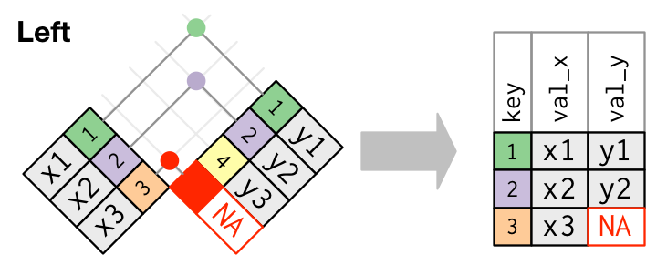
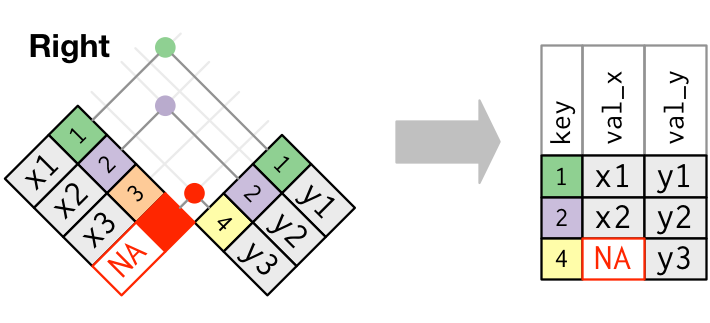
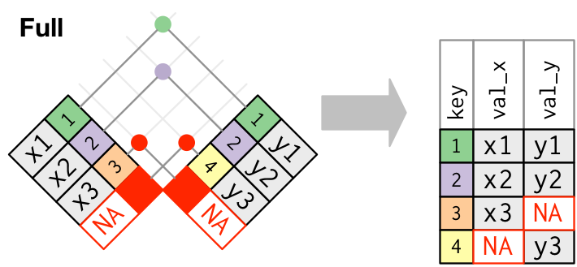

```{r setup, include=FALSE}
options(htmltools.dir.version = FALSE)
knitr::opts_chunk$set(cache = TRUE, dev = 'svg', echo = TRUE, message = FALSE, warning = FALSE,
                      fig.height=6, fig.width = 1.777777*6)

library('dplyr')
library('tibble')

library('readr')
library('readxl')

library('vroom')
library('here')
health <- vroom::vroom('./data/medicare-healthcare-providers/Healthcare Providers.csv')

library('tidyr')
library('forcats')
library('janitor')
library('ggplot2')
library('nycflights13')

```

# What are data frames?

Data frames are R's equivalent of an Excel spreadsheet

Data are arranged in rows and columns

* rows &mdash; observations

* columns &mdash; variables

Data frames are really lists, where each component of the list is required to
be a vector of the same length

Each column of the data frame can be of a difference type

---

# Creating data frames

Use the `data.frame()` function

```{r create-data-frame}
people <- data.frame(name   = c('Ada', 'Bob', 'Chris', 'Diya', 'Emma'),
                     height = c(64, 74, 69, 69, 71),
                     weight = c(135, 156, 139, 144, 152))
people
```

---

# Investigating data frames

There are many functions for working with data frames

Useful functions include

* `head()`

* `tail()`

* `nrow()`

* `ncol()`

---

# Accessing data frames

Can appear complicated because data frames are lists and matrix-like objects

.row[

.col-6[
List access:

* `people$height`
* `people[['height']]`
* `people[[2]]`
* `people[2]`

Last one extracts a data frame (list) with 1 column

]

.col-6[

```{r access-df-list}
people$height
people[['height']]
people[[2]]
people[2]
```

]

]

---

# Accessing data frames

Matrix-like access

Can use:

* row names and column names &mdash; `people['Ada', 'height']`

* row & column number (index) &mdash; `people[2, 3]`

* mixtures &mdash; `people[2, 'height']`

* extracting one or more rows &mdash; `people[2, ]`

* extracting one or more columns &mdash; `people[, 'height']`

* Can use numeric, character, logical indices

---

# Access data frames

.row[

.col-6[
```{r df-access-matrix-like-1}
rownames(people) <- people$name
people['Ada', ]
people[, 'height']
```
]

.col-6[
```{r df-access-matrix-like-2}
people[, c('height','weight')]
people[2:4, ]
```
]

]

---

# Tibbles

**Tibbles** are a modern implementation of the data frame concept

Widely used in the *Tidyverse* &mdash; a collection of packages that all share
common philosophy and approaches to working with data

Coerce a data frame to be a tibble with `as_tibble()` (from **tibble** 📦)

Load data directly to tibbles using the **readr**, **vroom**, & **readxl**
📦📦📦

---

# Tibbles

```{r print-tibble}
people <- tibble::as_tibble(people)
people
```

---

# Tibbles

.smaller[
```{r print-big-tibble}
health
```
]


---

# Tibbles

There are some differences

* `people$name` extracts a vector as usual but *never* partial matches &mdash; `people$nam` is an error

* `people[ , 'height']` extracts a 1-column data frame &mdash; `[r, c]` *never* drops empty dimensions

* tibbles are much faster for large data sets

* tibbles print differently &mdash; never again swamp your R session by accidentally printing a large data frame

---
class: inverse middle center subsection

# The Tidyverse

---

# The Tidyverse

.row[

.col-9[
> The tidyverse is an opinionated collection of R packages designed for data science. All packages share an underlying design philosophy, grammar, and data structures. &mdash; **www.tidyverse.org**

]

.col-3[
.center[
```{r echo = FALSE}
knitr::include_graphics('./resources/tidyverse-logo.png')
```
]

]

]


---

# The Tidyverse

A meta package that installs a core set of the tidyverse packages

* **ggplot2** &mdash; graphics & data viz following *The Grammar of Graphics*
* **dplyr** &mdash; a grammar of data manipulation
* **tidyr** &mdash; functions to achieve a zen-like tidy state in your data 🧘
* **readr** &mdash; fast, friendly ways to read rectangular data (`.csv`, `.tsv`, `.fwf`)
* **purrr** &mdash; enhanced functional programming replacing explicit loops
* **tibble** &mdash; a modern reimgaining of the data frame
* **stringr** &mdash; for working with strings in an easy manner
* **forcats** &mdash; for working with factors & categorical variables

---

# The Tidyverse

Addresses stages in the data science workflow

```{r r4ds-data-science-img, echo = FALSE, fig.align = 'center'}
knitr::include_graphics("./resources/r4ds-data-science.png")
```

.references[Wickham & Grolemund (2017) [R for Data Science](https://r4ds.had.co.nz/)]

---

# The Tidyverse

To install the suite of *tidyverse* packages use

```{r install-tidyverse, eval = FALSE}
install.packages('tidyverse')
```

To use the core *tidyverse* suite of packages in your code load the *tidyverse* package

```{r load-tidyverse, eval = FALSE}
library('tidyverse')
```

I don't recommend loading all the *tidyverse* this way though &mdash; you
should get into the habit of loading only the packages you will use / need

---

# Tidy data

> Tidy datasets provide a standardized way to link the structure of a dataset
(its physical layout) with its semantics (its meaning). &mdash; **Hadley
Wickham**

A way to arrange data that facilitates subsequent exploration, transformation,
visualization, & modelling of the data where

* each column is a variable
* each row is observation

---

# Reading data into R

There are many ways to read data into and out of R &mdash; you don't need the
Tidyverse for this

* `read.csv()` for example in base R

But&hellip;

* if we're following the Tidy principles, or
* we just want a cleaner, more intuitive interface

then two tidyverse packages can help **readr** and **readxl**

---

# Packages 📦

Unless you work with huge data sets or files created by subject-specific
software (e.g. GIS)

Data are mostly arranged in rectangular files

* Plain text files (CSV, TSV, FWF) &mdash; **readr** 📦 or **vroom** 📦

* Excel sheets or workbooks (Binary) &mdash; **readxl** 📦

Often medical or survey data is available in SAS files for use with the SAS
statistical software

* SAS data files &mdash; **haven** 📦

---

# Reading rectangular data &mdash; *readr* 📦

There are a few functions to remember for reading data

* reading comma delimited files &mdash; `read_csv("file.csv")`

* reading semi-colon delimited files &mdash; `read_csv2("file2.csv")`

* reading files with any delimiter &mdash; `read_delim("file.txt", delim = "|")`

* reading tab delimited files &mdash; `read_tsv("file.tsv")`

* reading fixed-width files &mdash; `read_fwf("file.fwf", col_positions = c(1, 3, 5))`

* reading files white-space-separated files &mdash; `read_table("file.txt")`

---

# Reading rectangular data

Several common, key arguments (plus some others for special cases, like
*locales*)

`col_names = TRUE` &mdash; `TRUE` is the default, does the first row contain
the column labels

`col_names = c('a', 'b', 'c')` &mdash; give the column names to use explicitly.
If you do:

**Must `skip = 1L` to skip reading the first row of data**

You can specify a column name as missing using `NA` &mdash; replaced with
`"X1"`, `"X2"` etc

---

# Reading rectangular data

`col_types` is the way to tell **readr** what data to expect

If not supplied **readr** will guess by reading the first `guess_max` rows

Can take 1 of 3 inputs

1. `NULL` &mdash; the default. Guess the data types by reading the first
    `guess_max = 1000` rows

2. A `cols()` column specification

3. A string of abbreviations indicating column types

---

# `cols()`

.row[

.col-6[
A list of column specifiers or *prototypes*

```{r cols-example}
cols(col_integer(), col_logical())
```
]

.col-6[
Lots of prototypes

See `?cols` for the full list

* `col_logical()` &mdash; `'l'`
* `col_integer()` &mdash; `'i'`
* `col_double()` &mdash; `'d'`
* `col_character()` &mdash; `'c'`
* `col_skip()` &mdash; `'_'` or `'-'`
* `col_guess()` &mdash; `'?'`
]
]

---

# Abbreviations

For data sets with many columns it is quicker to use the abbreviated form

`col_types = "-iddc?"`

Means

* skip the first column
* second column is an integer
* third and fourth columns are double
* fifth column is text/character
* guess the sixth column

---

# `spec()` & `problems()`

.smaller[
```{r load-health-bad, results = 'hide', message = TRUE}
# health <- read_csv(here('data', 'medicare-healthcare-providers', 'Healthcare Providers.csv'))
health <- read_csv("https://bit.ly/cvrug-providers")
problems(health)
```
]

If **readr** encounters problems reading a file it will attempt to do it's best to read it in

It will print a warning &mdash; don't ignore it! Use `problems()` to see what the problems were

---

# Writing rectangular data

There are a few functions to remember for writing data

* writing comma delimited files &mdash; `write_csv(x, "file.csv")`

* writing semi-colon delimited files &mdash; `write_csv2(x, "file2.csv")`

* writing files with any delimiter &mdash; `write_delim(x, "file.txt", delim = "|")`

* writing tab delimited files &mdash; `write_tsv(x, "file.tsv")`

* writing CSV for excel &mdash; `write_excel_csv(x, "file.csv")`

---

# Writing rectangular data

The first argument is the object to write to disk

The second argument is the path, which includes the *filename*

* `path = 'file.csv'` saves `file.csv` in the current working directory
* `path = 'output_data/file.csv'` saves `file.csv` in folder `output_data` of the working directory
* `path = '../output_data/file.csv'` saves `file.csv` in folder `output_data` *one level up* from working directory
* `path = here('output_data', 'file.csv')` saves `file.csv` in `output_data` folder in the project root

---

# Reading a writing R objects to disk

**readr** provides functions to serialize R objects to disk

* `read_rds('obj.rds)` reads a serialized object from disk

* `write_rds(obj, 'obj.rds')` serializes `obj` to disk

---
class: inverse middle center subsection

# Reading Excel sheets

---

# Reading Excel sheets

The **readxl** package provides a small set of functions for *reading from* Excel sheets and workbooks

Three main functions

1. `read_xls()` reads from older Office/Excel formatted files
2. `read_xlsx()` reads from newer Office/Excel formatted files
3. `read_excel()` determines which type of file you have, then call one or the other of `read_xls()` or `read_xlsx()` as needed

---

# Reading Excel sheets

To list all the sheets in a file use `excel_sheets()`

```{r list-excel-sheets}
xl_file <- here('data', 'medicare-healthcare-providers', 'Healthcare Providers.xlsx')
excel_sheets(xl_file)
```

---

# Reading Excel sheets

Say we wanted to read sheet 2, we could

```{r read-sheet-2}
health_2 <- read_excel(xl_file, sheet = 2)
```

or by name

```{r read-sheet-2-by-name}
health_2 <- read_excel(xl_file, sheet = 'Healthcare Providers_2')
```

---

# Reading Excel sheets (local)

As you don't have the file (yet!)

```{r}
fn <- "Healthcare Providers2.xlsx"
hp_url <- "https://bit.ly/cvrug-providers-xls"
download.file(hp_url, destfile = fn)
excel_sheets(fn)
health_2 <- read_excel(fn, sheet = 'Healthcare Providers_2')
```

---

# Reading Excel sheets

Can use `col_types` argument to tell **readxl** what data types to expect

The default is `NULL` which guess from `guess_max` rows of the data

Other option is to pass it a vector of one or more of these options

* `"skip"`,
* `"guess"`,
* `"logical"`,
* `"numeric"`,
* `"date"`,
* `"text"`, or
* `"list"`

Note this is the complete list &mdash; shorter than types for **readr** and no
abbreviations

---

# Reading Excel sheets

```{r read-health-proper}
col_types <- rep(c('numeric', 'text','numeric'), times = c(2, 18, 7))
(health_xl <- read_excel(xl_file, sheet = 1, col_types = col_types))
```

---

# Reading & writing large data sets

The **vroom** 📦 is a part of the wider *tidyverse* of packages

Can read data quickly from large files (millions or more rows) &mdash; reads
data quickly because it does so lazily, only reading data when you need it

Syntax and feature similar to **readr**

Reads delimited data and will deduce the delimiter for you

---

# vroom 📦

.smaller[
```{r vroom-health, message = TRUE}
## health <- vroom::vroom(here('data', 'medicare-healthcare-providers', 'Healthcare Providers.csv'))
hp_url <- "https://bit.ly/cvrug-providers"
health <- vroom::vroom(hp_url)
(s <- spec(health)) # save the spec, can reuse
```
]

---

# vroom 📦

If we pass the column specification to the `col_types` argument, we don't get any messages about how the data are read

.smaller[
```{r vroom-health-2, message = TRUE}
health <- vroom::vroom(here('data', 'medicare-healthcare-providers', 'Healthcare Providers.csv'),
                       col_types = s)
```
]

Useful if there are lots of columns and the data is read in cleanly &mdash; could store the spec (`write_rds()`) & load it for use in reloading the data

---
class: inverse middle center subsection

# Working directory

---

# Working directory

Throughout we've been specifying paths to files, either explicitly or via the **here** 📦

It is important to know where working directory is

In rstudio.cloud, R starts in the `project` folder

Use `getwd()` to query the working directory

```{r getwd}
getwd()
```

---

# Paths

Refer to files with relative paths if you want to share your work / scripts easily

But you still need to consider relative to what

Makes sense to always work from the same root directory for a given project

You should always start R in that root directory (use RStudio projects)

Refer to files as relative to the project root

---

# `here`

.row[

.col-6[

Helps you build relative paths

Heuristics help find the base of the project

* a `.here` file
* a file matching `[.]Rproj$`
* a `.git` file
* ...

]

.col-6[
```{r, out.width = "100%", echo = FALSE}
knitr::include_graphics("resources/here.png")
```
]

]

```{r}
here('data', 'medicare-healthcare-providers', 'Healthcare Providers.csv')
```


---
class: inverse middle center subsection

# Data wrangling with **dplyr** 📦

---

# Data wrangling

Wrangling data is (or should be) the most time-consuming aspect of a study &mdash; once collected!

.row[

.col-7[
*Wrangling* defined as

> engagement in a long, complicated dispute or argument

> round up, herd, or take charge of (livestock)

> alternative to *wangle*, to *manage to obtain (something) by persuading or cleverly manipulating someone*

]

.col-1[
&nbsp;
]

.col-4[
Better alternative to

* data processing
* data munging
* data manipulation
* &hellip;
]
]

---

# Data wrangling and *dplyr*

The *dplyr* package provides **five** key functions to solve most of the data wrangling issues you'll face

1. Choose observations (rows) based on values of variables (cols) &mdash; `filter()`
2. Reorder the observations (rows) &mdash; `arrange()`
3. Choose variables by name or other feature &mdash; `select()`
4. Create new variables as functions of existing ones &mdash; `mutate()`
5. Collapse many values into a single summary &mdash; `summarise()`

Each of these functions can be used with `group_by()` so that they affect each subset of data (group) in turn

These are the key data wrangling *verbs*

---

# Guiding principles

All verbs work in the same way, providing a consistent workflow with known outputs

1. the first argument to the verbs is *always* a data frame

2. subsequent arguments define what you want to with the data frame

3. the result of each verb (what is returned by the function) is *always* a data frame

---

# Global burden of disease

```{r load-disease}
burden_url <- "https://bit.ly/cvrug-burden"
# disease <- read_csv(here('data', 'gbd', 'gbd.csv'))
disease <- read_csv(burden_url)
```

```{r disease-show-data, echo = TRUE}
disease
```

---

# `filter()`

Subset observations based on the values or one or more of the columns

```{r disease-filter-2017}
filter(disease, year == 2017)
```

---

# The pipe `%>%`

The nature of *dplyr* verbs leads to a workflow where we create intermediate steps

1. group the data using `group_by()`
2. summarise the grouped data by group using `summarise()`

We perhaps don't need to store the output of the first operation

The pipe operator `%>%` allows use to compose *dplyr* verbs into a workflow to achieve a data wrangling outcome

---

# Plot

```{r gbd-2017-plot-prep}
gbd17 <- disease %>% filter(year == 2017) %>%
    mutate(income = fct_relevel(income,
                                'Low', 'Lower-Middle',
                                'Upper-Middle', 'High'))
gbd17
```

---

```{r gbd-2017-plot, fig.height = 4}
ggplot(gbd17, aes(x = sex, y = deaths_millions, fill = cause)) +
    geom_col(position = 'dodge') +
    facet_wrap(~ income, ncol = 4) +
    theme(legend.position = 'top') +
    labs(x = NULL, y = 'Deaths (millions)', fill = NULL)
```

---

# `arrange()`

Sort the rows according to a condition or variable

```{r disease-arrange-deaths}
arrange(disease, deaths_millions)
```

---

# `desc()`

Arrange in descending order using `desc()`

```{r disease-arrange-rating-desc}
arrange(disease, desc(deaths_millions))
```

---

# `select()`

Choose which variables to view or work with

```{r disease-select, error = TRUE}
select(disease, c(year, sex, income))
```

---

# `select()` &mdash; many options for selecting

.row[

.col-6[

`matches()`

```{r disease-select-matches}
select(disease, matches('deaths'))
```
]

.col-6[

`last_col()`

```{r disease-select-last-col}
select(disease, last_col())
```
]
]

---

# `select()` &mdash; many options for selecting

.row[

.col-6[

`from:to`

```{r disease-select-colon}
select(disease, year:income)
```
]

.col-6[

`starts_with()`

```{r disease-select-starts-with}
select(disease, starts_with('i'))
```
]
]

---

# `select()` &mdash; many options for selecting

Many options for choosing columns in `select` &mdash; see `?dplyr::select`

---

# `summarise()`

Summarise data to a single row

```{r disease-summarise}
disease %>% summarise(total_deaths = sum(deaths_millions))
```

---

# `group_by()`

`summarise()` becomes much more useful if we group data first

```{r disease-group-by}
disease %>%
    group_by(cause) %>%
    summarise(total_deaths = sum(deaths_millions))
```

---

# `group_by()`

Can group by multiple variables; grouping applied in the order given

```{r disease-group-by-2}
disease %>%
    group_by(cause, sex) %>%
    summarise(total_deaths = sum(deaths_millions))
```

---

# `mutate()`

Create new variable or modify existing ones

```{r disease-mutate}
disease %>%
    group_by(cause, sex) %>%
    summarise(deaths_per_group = sum(deaths_millions),
              .groups = "keep") %>%
    mutate(deaths_total = sum(deaths_per_group)) %>% #<<
    ungroup()
```

---
class: inverse middle center subsection

# Tidying data with *tidyr*

---

# Tidy data

> Tidy datasets provide a standardized way to link the structure of a dataset
(its physical layout) with its semantics (its meaning). &ndash; **Hadley
Wickham**

A way to arrange data that facilitates subsequent exploration, transformation,
visualization, & modelling of the data where

* each column is a variable
* each row is observation

---

# Wide or long?

Look at an alternative way of storing the GBD data

```{r show-gbd-wide, echo = FALSE}
disease_wide <- disease %>%
    pivot_wider(names_from = c(sex, year),
                values_from = deaths_millions,
                names_sep = ':')
disease_wide
```

---

# Wide or long?

The data are also in what we call wide format &mdash; where multiple
observations are in a row

To fit a statistical model we need them in long format &mdash; where each row
corresponds to a single observation

---

# Wide or long?

```{r show-wide-long-image, echo = FALSE, out.width = '80%', fig.align = 'center'}
knitr::include_graphics('resources/original-dfs-tidy.png')
```

---

# Pivoting

Converting between a *wide* and *long* representations is called *pivoting*

```{r show-wide-long-git, echo = FALSE, out.width = '50%', fig.align = 'center'}
knitr::include_graphics('resources/tidyr-longer-wider.gif')
```

---

# `gather()` & `spread()`

An earlier implementation in *tidyr* 📦 used

* `gather()`
* `spread()`

roughly corresponding to 

* `pivot_longer()`
* `pivot_wider()`

The `pivot_*()` functions are to be preferred now

---

# `pivot_longer()`

To go from the wide version of `disease` to the long form we use `pivot_longer()`

```{r pivot-disease-longer}
disease_wide %>%
    pivot_longer(matches('Female|Male'), # matches any column with 'Female' or 'Male' in name
                 names_to = c('sex', 'year'), # variables to create in long form
                 values_to = 'deaths_millions', # column to put the data into
                 names_sep = ':')               # how to split names_to columns?
```

---

# `pivot_wider()`

Wider forms of data tend to be easier for humans to work with outside R


```{r pivot-disease-wider}
disease %>%
    pivot_wider(names_from = c(sex, year),     # which columns to spread out
                values_from = deaths_millions, # which column to take data from
                names_sep = ':') %>%           # how split names_from columns?
    head()                                     # show just first 6 rows
```

---
class: inverse center middle subsection

# Relational Data

---

# New York Flights

**nycflights13** contains five tables

1. `flights`
2. `airlines`
3. `airports`
4. `planes`
5. `weather`

---

# New York Flights

```{r}
flights
```

---

# New York Flights

```{r}
airlines
```

---

# New York Flights

```{r}
airports
```

---

# New York Flights

```{r}
planes
```

---

# New York Flights

```{r}
weather
```

---

# New York Flights
.row[
.col-12[
.center[
```{r echo = FALSE, out.width = '90%'}
knitr::include_graphics("./resources/relational-nycflights.png")
```
]
]
]

.small[Source: Wickham & Grolemund *R for Data Science*]

---
class: inverse center middle subsection

# Keys

---

# Keys

Variables that connect each pair of tables are called **keys**

Each plane is uniquely identified by the `tailnum`

Two types of *key*

1. **Primary key** &mdash; uniquely identifies an observation in it's own table
    `planes$tailnum`
2. **Foreign key** &mdash; uniquely identifies an observation in another table
    `flights$tailnum`

*Surrogate keys* are keys that are created when a table doesn't have one or
more variables that uniquely identify an observation

```{r eval = FALSE}
mutate(tbl, id = row_number())
```

---
class: inverse center middle big-subsection

# Joins

---

# Mutating joins

.row[
.col-12[
```{r echo = FALSE}
knitr::include_graphics("./resources/join-setup.png")
```
]
]

.small[Source: Wickham & Grolemund *R for Data Science*]

---

# Joins

.row[
.col-12[
```{r echo = FALSE}
knitr::include_graphics("./resources/join-setup2.png")
```
]
]

.small[Source: Wickham & Grolemund *R for Data Science*]

---

# Joins

.row[
.col-12[
```{r echo = FALSE}
knitr::include_graphics("./resources/join-inner.png")
```
]
]

.small[Source: Wickham & Grolemund *R for Data Science*]

---

# Inner Join

.row[
.col-12[
```{r echo = FALSE}
knitr::include_graphics("./resources/join-inner.png")
```
]
]

.small[Source: Wickham & Grolemund *R for Data Science*]

---

# Outer Joins

.row[

.col-8[

* **left join**

* **right join**

* **full join**

]
.col-4[
```{r echo = FALSE}
knitr::include_graphics("./resources/join-outer.png")
```
]
]

.small[Source: Wickham & Grolemund *R for Data Science*]

---

# Left Join

.row[
.col-12[
```{r echo = FALSE}

```
]
]

.small[Source: Wickham & Grolemund *R for Data Science*]

---

# Right Join

.row[
.col-12[
```{r echo = FALSE}

```
]
]

.small[Source: Wickham & Grolemund *R for Data Science*]

---

# Full Join

.row[
.col-12[
```{r echo = FALSE}

```
]
]

.small[Source: Wickham & Grolemund *R for Data Science*]

---

# Outer Joins

.row[
.col-12[
```{r echo = FALSE}
knitr::include_graphics("./resources/join-venn.png")
```
]
]

.small[Source: Wickham & Grolemund *R for Data Science*]

---
class: inverse center middle subsection

# Filtering joins

---

# Semi Joins

Semi joins **keep** all observations in `x` that have a match in `y`

.row[
.col-12[
```{r echo = FALSE}
knitr::include_graphics("./resources/join-semi.png")
```
]
]

.small[Source: Wickham & Grolemund *R for Data Science*]

---

# Semi Joins

Filtering joins never duplicate rows unlike mutating joins

.row[
.col-12[
```{r echo = FALSE}
knitr::include_graphics("./resources/join-semi-many.png")
```
]
]

.small[Source: Wickham & Grolemund *R for Data Science*]

---

# Anti Joins

Anti joins **drop** all observations in `x` that have a match in `y`

.row[
.col-12[
```{r echo = FALSE}
knitr::include_graphics("./resources/join-anti.png")
```
]
]

.small[Source: Wickham & Grolemund *R for Data Science*]

---
class: inverse middle center big-subsection

# Examples

---

# ER injuries

ER injuries data set consists of three tables of data

```{r load-injuries}
# injuries <- vroom::vroom('data/er-injuries/injuries.tsv.gz')
download.file("https://bit.ly/cvrug-er-injuries", destfile = "injuries.tsv.gz")
injuries <- vroom::vroom("injuries.tsv.gz", delim = "\t")
injuries
```

---

# ER injuries &mdash; products


```{r load-products}
# products <- vroom::vroom('data/er-injuries/products.tsv')
products <- vroom::vroom("https://bit.ly/cvrug-er-products")
products
```
---

# ER injuries &mdash; population


```{r load-population}
# population <- vroom::vroom('data/er-injuries/population.tsv')
population <- vroom::vroom("https://bit.ly/cvrug-er-population")
population
```

---

# ER injuries

.row[

.col-6[
```{r steps-and-stairs}
selected <- injuries %>%
    filter(prod_code == 1842)
selected %>% 
    count(age, sex, wt = weight)
```
]

.col-6[
```{r}
population
```
]
]

---

# ER injuries &mdash; left join

One row per result of `count()`

.row[

.col-6[
```{r}
selected %>%
    count(age, sex, wt = weight) %>% 
  left_join(population, by = c("age", "sex"))
```
]

.col-6[
```{r}
population
```
]

]

---

# ER injuries &mdash; left join

One row per result of `count()`

.row[

.col-12[
```{r}
injuries %>% 
    left_join(products, by = 'prod_code') %>%
    select(c(trmt_date:sex, prod_code, title))
```
]

]

---

# ER injuries &mdash; inner join

Now we only get the rows where we have matches in both tables

.row[

.col-6[
```{r}
selected %>%
    count(age, sex, wt = weight) %>% 
  inner_join(population, by = c('age', 'sex'))
```
]

.col-6[
```{r}
population
```
]

]

---

# ER injuries &mdash; right join

Here we get all rows of `population` with the matches from `count()`

.row[

.col-6[
```{r}
selected %>% 
    count(age, sex, wt = weight) %>% 
  right_join(population, by = c('age', 'sex'))
```
]

.col-6[
```{r}
population
```
]

]

---

# ER injuries &mdash; outer join

.row[

.col-6[
```{r}
selected %>% 
    count(age, sex, wt = weight) %>% 
  full_join(population, by = c('age', 'sex'))
```
]

.col-6[
```{r}
population
```
]

]

---

# ER injuries &mdash; semi join

Here we keep rows of `count` **with** a match in `population`, but we don't pull in columns from `population`

.row[

.col-6[
```{r}
selected %>% 
    count(age, sex, wt = weight) %>% 
  semi_join(population, by = c('age', 'sex'))
```
]

.col-6[
```{r}
population
```
]

]

---

# ER injuries &mdash; anti join

Here we keep only the rows of `count` **without** a match in `population`

.row[

.col-6[
```{r}
selected %>% 
    count(age, sex, wt = weight) %>% 
  anti_join(population, by = c('age', 'sex'))
```
]

.col-6[
```{r}
population
```
]

]
