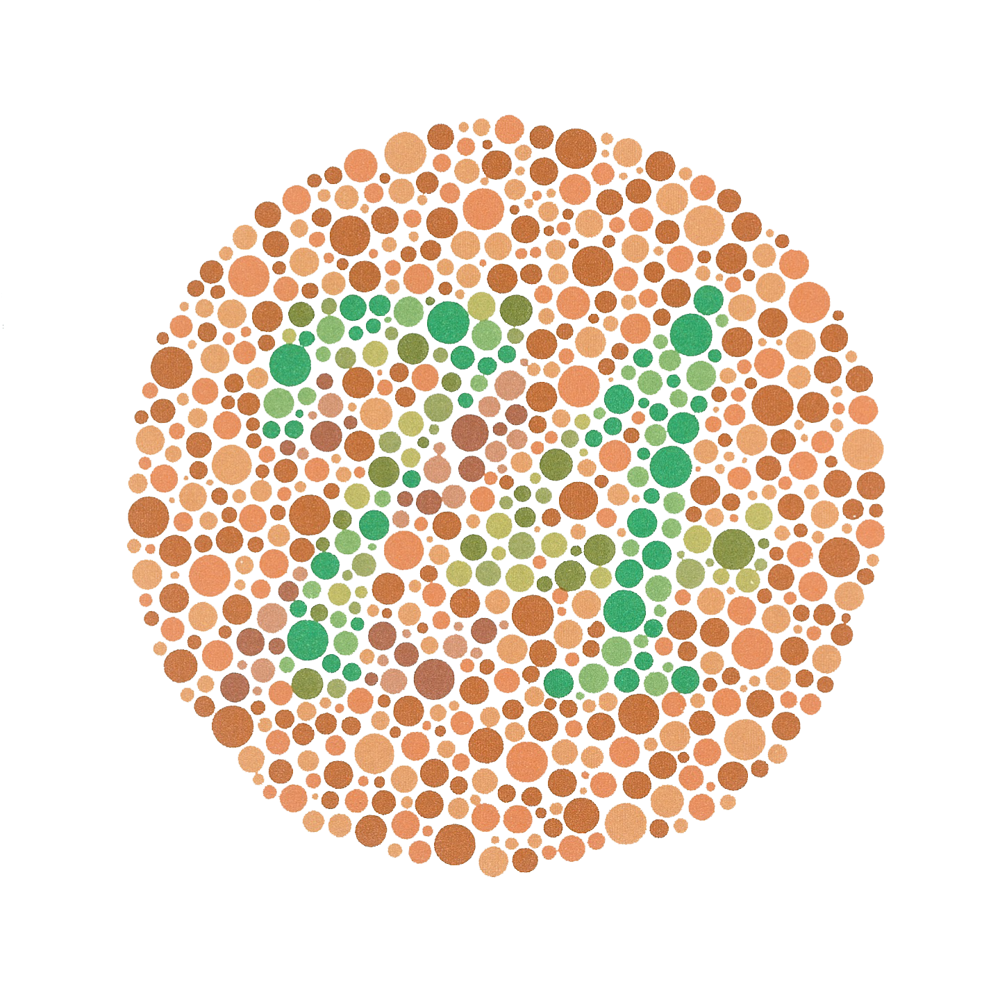

```{r setup, include=FALSE}
options(htmltools.dir.version = FALSE)
knitr::opts_chunk$set(cache = TRUE, dev = 'svg', echo = TRUE, message = FALSE, warning = FALSE,
                      fig.height=6, fig.width = 1.777777*6)
library('ggplot2')
library('dplyr')
library('tidyr')
library('colorspace')
library('cowplot')
theme_set(theme_minimal(base_size = 16, base_family = 'Fira Sans'))
```

# Learning objectives

At the end of this topic you should be able to

* Understand the basic principles of data visualization

* Understand how human brains perceive colour

* Know which visual attributes or channels are most effective

* Know how to represent different kinds of data visually

* Basic understanding of how to produce visualizations using the *ggplot2* package

---

# Readings

* Wickham (2016) [*ggplot2*: Elegant Graphics for Data Analysis](https://link.springer.com/book/10.1007/978-3-319-24277-4). Springer.
* Wilke (2019) [Fundamentals of Data Visualization](https://clauswilke.com/dataviz/). O'Reilly.
* Healy (2019) [Data Visualization; a practical introduction](https://socviz.co/). Princeton University Press.


---

# Data Visualization

Some data visualizations are better than others

---
class: inverse
background-image: url('./resources/emily-morter-188019-unsplash.jpg')
background-size: cover

# Why?

---

# Data Visualization

Some data visualizations are better than others

* Taste
    * The eye is in the beholder
* Choice of data
* Human visual perception
---

# What makes bad figures?

**Aesthetic**

Tacky, tasteless, ugly, hodgepodge, inconsistent design

**Substantive**

Graph has problems because of the data being presented

**Perceptual**

Inspite of good taste and good data, a graph may be *confusing* or *misleading* because of how people perceive and process what they are looking at

---

# Always plot your data

.row[

.col-6[

* Anscombe's quartet
* Scatterplot
    * 2 quantities mapped to x and y axis
* $x$ and $y$ in each set have the same
    * mean
    * variance
* Regression lines have same $\hat{\beta}$
* $x$ and $y$ have the same correlation
]
.col-6[

```{r anscombe, echo = FALSE, fig.width = 6, fig.height = 6}
anscombe_tidy <- anscombe %>%
    mutate(observation = seq_len(n())) %>%
    gather(key, value, -observation) %>%
    separate(key, c("variable", "set"), 1, convert = TRUE) %>%
    mutate(set = c("I", "II", "III", "IV")[set]) %>%
    spread(variable, value)

ggplot(anscombe_tidy, aes(x, y)) +
    geom_point() +
    facet_wrap(~ set) +
    geom_smooth(method = "lm", se = FALSE)

```

]

]

---

# Visualising data

.center[]

---

# Visualising data

.center[]

---

# Visualising data

.center[]

---
class: inverse
background-image: url('./resources/franki-chamaki-694946-unsplash.jpg')
background-size: cover

# 

---

# Bad data

.center[]

---

# Bad data

.center[]

---

# Bad Data

.center[]

---

# Perception

.row[

.col-6[


]

.col-6[


]

]

--


???
Herman grid effect: ghostly blobs appear at the intersections in the grid, but
only if you aren't looking directly at the intersection

Mach bands: Along the boundary between adjacent shades of grey in the Mach bands
illusion, lateral inhibition makes the darker area falsely appear even darker
and the lighter area falsely appear even lighter.

Our visual system is constructing a representation of what is being looked at
based more on *relative* differences in the luminance (brightness) of the bars,
rather than the absolute value.

---

# Perception

Which is darker, **A** or **B**?

.center[]


???

Visual system is attracted to edges and we assess contrast and brightness
relatively rather than in absolute terms.

Edward Adelson's checker-shadow illusion

Perception views the tile in shadow as being lighter

---

# Perception

Which is darker, **A** or **B**?

.row[

.col-6[
.center[]
]

.col-6[
.center[]
]

]

---

# Perception

What colour is the dress? Blue & Black or White & Gold?

.center[]

--

The dress was actually Blue and Black

---

# Perception

Which is darker, **A** or **B**?

.row[

.col-6[
.center[]
]

.col-6[
.center[]
]

]

---
class: inverse
background-image: url('./resources/isaac-smith-1182056-unsplash.jpg')
background-size: cover

# Mapping

---

# Mapping

Drawing a graph involves mapping data to visual attributes &mdash; some more effective than others

.center[]

---

# Accuracy of Mappings

.center[]

---
background-image: url('./resources/sharon-pittaway-98257-unsplash.jpg')
background-size: cover

# Colour

---
class: inverse
background-image: url('./resources/michael-maasen-587273-unsplash.jpg')
background-size: cover

# Colour models

---

# Colour models

.row[

.col-6[

* Red Green Blue &mdash; RGB
    * Hexadecimal (base 16)
    * '0'&ndash;'9' with 'A'&ndash;'F' for 10-15
    * Encode 256 values of each colour
    * In R `"#AA6633"`
    * TVs, Digital cameras, etc
* Cyan Yellow Magenta Black &mdash; CYMK
    * Covers a much wider range of colours than RGB
    * Magazines, printing

]

.col-6[

* Hue Chroma Luminance &mdash; HCL
    * Hue &mdash; colour
    * Chroma &mdash; how much of the colour
    * Luminance &mdash; brightness
    * Designed to reflect human colour perception
* Hue Saturation Lightness &mdash; HSL
]

]

---

# Colour palettes

A colour palette is the colour scheme or selection used to represent data or design on a graph

Want more than a numerical mapping &mdash; want perceptually uniform mappings

.row[

.col-4[

* discrete

* sequential

* diverging

]

.col-8[

.center[
```{r discrete-pal, fig.height = 1, fig.width = 7, echo = FALSE, dpi = 150}
op <- par(mar = c(0,0,0,0) + 0.1)
swatchplot(qualitative_hcl(7, palette = "set2"))
par(op)
```
```{r sequential-pal, fig.height = 1, fig.width = 7, echo = FALSE, dpi = 150}
op <- par(mar = c(0,0,0,0) + 0.1)
swatchplot(sequential_hcl(7, palette = "Inferno"))
par(op)
```
```{r diverging-pal, fig.height = 1, fig.width = 7, echo = FALSE, dpi = 150}
op <- par(mar = c(0,0,0,0) + 0.1)
swatchplot(diverging_hcl(7, palette = "Blue-Red"))
par(op)
```
]

]
]

---

# Discrete palettes

.row[

.col-6[

* Categorical data

* Easily distinguishable

* Favour no one colour

* Vary H, constant C & L

]

.col-6[

.center[
```{r hcl-discrete-spectrum, fig.height = 8, fig.width = 8, echo = FALSE, dpi = 150}
p <- qualitative_hcl(5, palette = "set2")
specplot(p)
```
]
]
]

---

# Sequential palettes

.row[

.col-6[

* Continuous data

* Brightness & intensity of colour vary

* Vary C & L, constant H

]

.col-6[

.center[
```{r hcl-sequential-spectrum, fig.height = 8, fig.width = 8, echo = FALSE, dpi = 150}
specplot(sequential_hcl(50, palette = "Blues-2"))
```
]

]

]

---

# Sequential multi-hue palettes

.row[

.col-6[

* Continuous data

* Can vary everything if careful

* Vary H, C & L

]

.col-6[

.center[
```{r hcl-sequential-spectrum-2, fig.height = 8, fig.width = 8, echo = FALSE, dpi = 150}
specplot(sequential_hcl(100, palette = "Inferno"))
```
]

]

]

---

# Diverging palettes

.row[

.col-6[

* Continuous data where mid-point means something (0)

* Single hue in each arm

* C & L are balanced in each arm

* C goes to 0 at mid-point


]

.col-6[

.center[
```{r hcl-diverging-spectrum, fig.height = 8, fig.width = 8, echo = FALSE, dpi = 150}
specplot(diverging_hcl(100, palette = "Blue-Red"))
```
]

]

]

---

# Rainbow

.center[
```{r rainbow-swatch, fig.height = 3, fig.width = 8, echo = FALSE, dpi = 150}
swatchplot(rainbow(500))
```
]

---

# #endrainbow

.row[

.col-6[

* Luminance is not linear or even monotonic

* Colour vision deficiency

]

.col-6[

.center[
```{r rainbow-spectrum, fig.height = 8, fig.width = 8, echo = FALSE, dpi = 150}
specplot(rainbow(100), rgb = TRUE)
```
]

]

]

---

# #endrainbow

.center[
```{r rainbow-desat-swatch, fig.height = 3, fig.width = 8, echo = FALSE, dpi = 150}
swatchplot(desaturate(rainbow(500)))
```
]

---

# #endrainbow

.center[
```{r rainbow-deutan-swatch, fig.height = 3, fig.width = 8, echo = FALSE, dpi = 150}
swatchplot(tritan(rainbow(500)))
```
]

---

# Colour vision deficiency

Decreased ability to see colour or differences in colour

.row[

.col-6[

* Red-Green CVD is sex-linked
* Gene carried on X chromosome
* Blue-Yellow CVD is not; chromosome 7
* -anomaly vs -anopia

.center[]

]

.col-6[

.center[]

]

]

---

# Pop

Can you see the green squares?

.center[]

---

# Preattentive pop-out

Some shapes, colours, angles more easy to spot

Can happen before (or almost before) before consciously looking at something

.row[

.col-6[

.center[]

]

.col-6[

.center[]

]

]

.row[

.col-6[

.center[]

]

.col-6[

.center[]

]

]

---

# Pop &mdash; find the blue circle

```{r pop-1, echo = FALSE, dpi = 200, fig.width = 16, fig.height = 8, out.height = 550}
theme_set(theme_minimal(base_size = 16, base_family = 'Fira Sans'))
set.seed(1)
N <- 20
df <- data.frame(x = runif(N), y = runif(N), grp = sample(rep(c('a','b'), times = c(1, N-1))))
p1 <- ggplot(df, aes(x = x, y = y, colour = grp)) +
    geom_point(size = 2.5) +
    scale_colour_manual(values = c('#004488','#ddaa33')) +
    theme(legend.position = 'none') +
    labs(title = 'N = 20', y = NULL, x = NULL) +
    coord_cartesian(xlim = c(0,1), ylim = c(0,1))
set.seed(100)
N <- 100
df <- data.frame(x = runif(N), y = runif(N), grp = sample(rep(c('a','b'), times = c(1, N-1))))
p2 <- ggplot(df, aes(x = x, y = y, colour = grp)) +
    geom_point(size = 2.5) +
    scale_colour_manual(values = c('#004488','#ddaa33')) +
    theme(legend.position = 'none') +
    labs(title = 'N = 100', y = NULL, x = NULL) +
    coord_cartesian(xlim = c(0,1), ylim = c(0,1))
set.seed(200)
N <- 20
df <- data.frame(x = runif(N), y = runif(N), grp = sample(rep(c('a','b'), times = c(1, N-1))))
p3 <- ggplot(df, aes(x = x, y = y, shape = grp)) +
    geom_point(size = 2.5, colour = '#004488') +
    theme(legend.position = 'none') +
    labs(title = 'N = 20', y = NULL, x = NULL) +
    coord_cartesian(xlim = c(0,1), ylim = c(0,1))
set.seed(300)
N <- 100
df <- data.frame(x = runif(N), y = runif(N),
                 grp1 = sample(rep(c('a','b'), each = N/2)),
                 grp2 = sample(rep(c('1','2'), each = N/2)))
take <- with(df, which(grp1 == "a" & grp2 == "1"))
df[take[-sample(take, 1)], "grp1"] <- 'b'
p4 <- ggplot(df, aes(x = x, y = y, colour = grp1, shape = grp2)) +
    geom_point(size = 2.5) +
    scale_colour_manual(values = c('#004488','#ddaa33')) +
    theme(legend.position = 'none') +
    labs(title = 'N = 100', y = NULL, x = NULL) +
    coord_cartesian(xlim = c(0,1), ylim = c(0,1))
plot_grid(p1, p2, p3, p4, nrow = 1)
```

---
# Bad graphs

.center[]

---

# Bad graphs

.center[]

---

# Bad graphs

.center[]

---

# Bad graphs

.center[]

---

# Bad graphs

.center[]

---

# Bad graphs

.center[]


